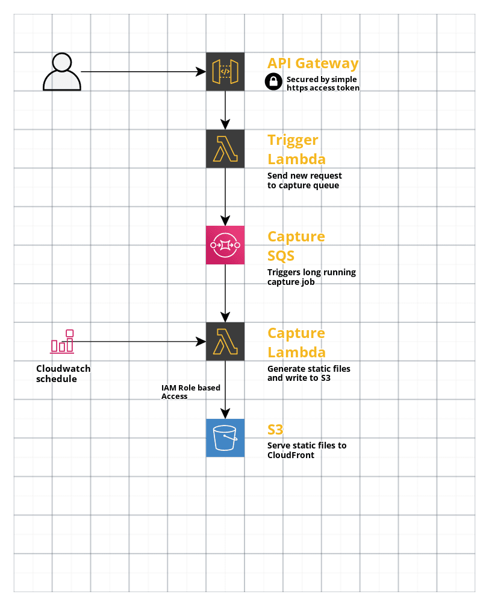

# Page Capture S3



A NodeJS Lambda that can capture a single HTML page and all of the associated files that are served from the same domain.  The lambda can push these files to a designated S3 bucket.  This is useful if you have a page being dynamically generated and want to periodically render it to static files that can be served to the web directly out of S3.

For example, capturing the home page at `www.bu.edu` will also pull in and relink associated images, css, js, etc. that are served from the `www.bu.edu/` domain.  External links will be left as.

The lambda is triggered by a secure API gateway interface using an API key.  API Gateway requests have a 30 second time limit, so the API Gateway feeds a "trigger" lambda that passes the request to an SQS queue.  This allows the API Gateway request to answer quickly while the capture lambda is triggered by the longer-running SQS service.

The function includes error checking, and will cancel downloads on any assets that do not return a status code 200 (OK).  If the root page capture fails, the entire capture is cancelled and no changes will be made to the current contents of the S3 bucket.

There is also a schedule event defined that will run the capture lambda every hour.  It is not enabled by default.

## How to configure

The capture URL, S3 bucket name, and S3 bucket path are defined as configurable parameters in the infrastructure template.  Also, the captured assets can be stored in a separate subdirectory, if one is specified in the config.

- `CaptureUrl` sets the URL to the page to be captured.
- `S3BucketName` sets the destination S3 bucket for the captured static files.
- `S3Path` sets a path within the bucket for the capture directory.  If blank, the root of the bucket will be used.
- `SubdirPrefix` sets the name of the sub-directory used to store the assets (use the directory name only, no trailing slash).  If blank, assets will be stored at the root.

These parameters are passed as environment variables to the capture lambda.

## How to install

Page Capture S3 uses the [AWS SAM frramework](https://aws.amazon.com/serverless/sam/) to manage the API gateway and Lambda infrastrucure components.  It assumes an existing S3 bucket for the static files (named `S3BucketName` in the template parameters).

The [SAM CLI tool is available for various platforms](https://docs.aws.amazon.com/serverless-application-model/latest/developerguide/serverless-sam-cli-install.html), and can be installed for macOS with homebrew like so:

```bash
brew tap aws/tap
brew install aws-sam-cli
```

Also there must be existing AWS cli credentials for the account where the Lambda will be installed (generally `aws config`).

Once the SAM cli is installed, the Lambda infrastructure can be provisioned on AWS using the `deploy` command:

```bash
sam build
sam deploy --guided
```

This will compile the Lambda and template code and launch a guided SAM deploy, prompting for template parameters a and Cloudformation stack name. SAM will then execute the compiled Cloudformation directives and return the following outputs:

- an endpoint URL for the API gateway: together with the API key, this can be used to trigger the capture Lambda through the SQS queue
- a link to the API key that secures the private API gateway

## How to trigger

The Lambda can be triggered by an https request to the gateway endpoint that includes the key in a header named `x-api-key`.

For example:

```bash
curl --header "x-api-key: <key>" https://<gateway url>
```

Here is a PHP example using the `wp_remote_get()` function inside WordPress:

```php
$api_key = '<key>';
$api_url = '<gateway url>';

$response = wp_remote_get( $api_url, array( 'timeout' => 30, 'headers' => array( 'x-api-key' => $api_key, ) ) );
```

## How to monitor

CloudWatch logs are provisioned along with the Lambda.  A console link to the CloudWatch events is available in the Resources tab of the CloudFormation stack.  Recent logs are also available through the SAM cli like this:

```bash
sam logs --stack-name <name of the deployed cloudformation stack>
```

## Local testing

The capture Lambda can simulated locally using the `sam local` cli command.  There are npm scripts defined in the `package.json` scripts section to simulate the two different triggers for the capture lambda.

To simulate the SQS trigger, run:

```bash
npm run local:sqs
```

To simulate the Eventbridge schedule trigger, run:

```bash
npm run local:schedule
```

## How to remove

The Lambda and all of it's associated resources can be removed by deleting the CloudFormation stack.  The existing S3 bucket specified for the static assets will not be affected.

The CloudFormation stack can also be removed using the sam cli:

```bash
sam delete  --stack-name <name of the deployed cloudformation stack>
```

## BU Specific deploy parameters

There is a `samconfig.toml` file that contains preset deploy parameters for use at BU.  There are `test` and `prod` stage profiles that can be used to update the existing deployments.

From the webrouter non-prod account, the following command will deploy to the existing test setup:

```bash
sam deploy --config-file=samconfig.toml --config-env=test
```

From the webrouter prod account, this will deploy to the existing prod setup:

```bash
sam deploy --config-file=samconfig.toml --config-env=prod
```
